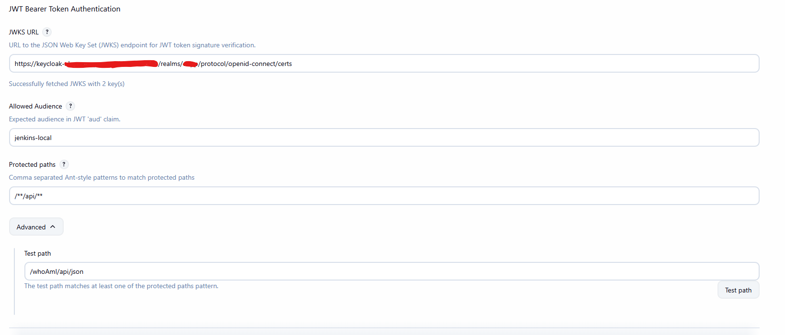
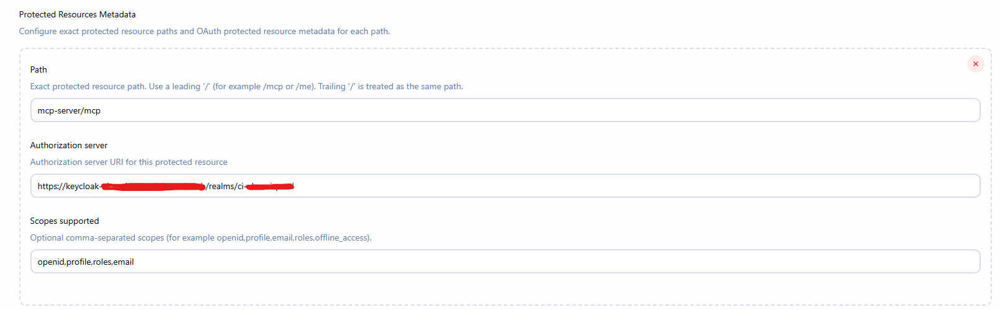

# jwt-auth-filter-plugin

This plugin include a request filter to validate a JWT tokens passed as Bearer token in Authorization header.

It is useful for API access when token is obtained via an identity provider and already contains the correct audience (For example via a Token Exchange (RFC 8693))

This is not a security realm plugin, but it set a user principal and authorities to the security context, so it can be used in combination with other security realm plugins that perform user login on Jenkins UI and authenticate via session cookies.

This plugin only cares about 'Bearer' token in the `Authorization` header that are JWTs.

If validation fails for any reason (invalid token, expired, wrong audience, etc) the filter will ignore the token and let the request continue for other filers.
When `protectedResources` are configured with per-resource metadata, a dedicated challenge filter adds:

```text
WWW-Authenticate: Bearer resource_metadata="<jenkins-root>/.well-known/oauth-protected-resource/<resource-path>"
```

for exact-match protected resource paths when no bearer token is present.

This means "HTTP basic authentication" is still possible (via username/password or username/api-token).

The plugin exposes `/.well-known/oauth-protected-resource/<resource-path>` with OAuth 2.0 Protected Resource Metadata (RFC 9728), resolved from the exact protected resource path.

## Limitations

Right now claims are hardcoded to `preferred_username` for the user principal, `name` for full name, `email` for email and `groups` for the authorities.

Feel free to open a PR to make it configurable.

JWT token always validated against the JWKS endpoint provided on the system configuration. No caching of the keys is done in this first plugin iteration.

## Getting started

Install the plugin and configure the JWKS and allowed audience in the 'Security' section.

By default the filter is applied to the following path: `/**/api/**` to only only API access (XML/JSON).

This can be adapted, assuming you have a plugin that expose '/mcp' endpoint. You can extend the filter to `/**/api/**,/mcp/**` to also protect the '/mcp' endpoint.



Protected resources (RFC 9728) are optional (depending if you care about the authorization flow or only validating JWT token and act as a pure resource server)



Or via JCasC

```yaml
security:
  jwtBearer:
    protectedResources:
      - path: "/mcp"
        authorizationServer: "https://auth.example.com"
        scopesSupported:
          - "mcp:read"
          - "mcp:write"
      - path: "/me"
        authorizationServer: "https://auth2.example.com"
    issuers:
      - jwksUrl: "https://keycloak-casc-test.example.com/realms/jenkins/protocol/openid-connect/certs"
        allowedAudience: "jenkins-casc-test2"
        protectedPaths: "/mcp/**"
      - jwksUrl: "https://keycloak-casc-test.other.com/realms/jenkins/protocol/openid-connect/certs"
        allowedAudience: "jenkins-casc-test2"
        protectedPaths: "/**/api/**"
        usernameClaim: "sub"
        nameClaim: "full_name"
        emailClaim: "mail"
        groupsClaim: "roles"
```

In the Jenkins UI, `Scopes supported` is a comma-separated string (for example:
`openid,profile,email,roles,offline_access`) and is returned as
`"scopes_supported":[...]` in the protected resource metadata response.

For manual tests you can use following commands to request a token and use it to access the API:

```bash
export IDP_URL="...."
export CLIENT_ID="jenkins-local" # Assuming it matches your audience (public client, not recommended)
export HTTP_AUTH="Authorization: Bearer $(step oauth --client-id ${CLIENT_ID} --provider $IDP_URL --scope="roles offline_access profile openid email" | jq -r .access_token)"
http -v ":8080/jenkins/api/json?tree=jobs[name]" "${HTTP_AUTH}"
```

## LICENSE

Licensed under MIT, see [LICENSE](LICENSE.md)
